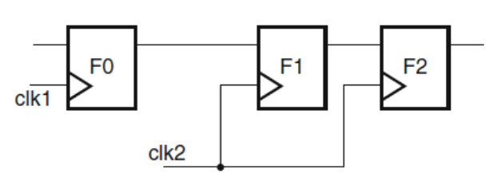
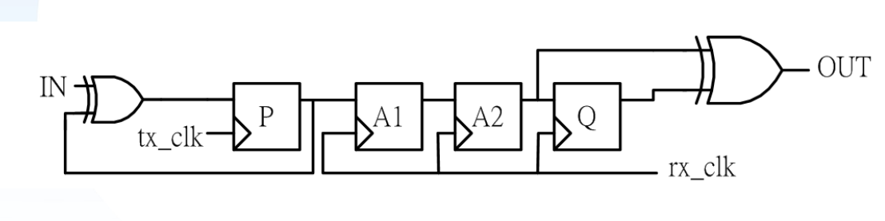
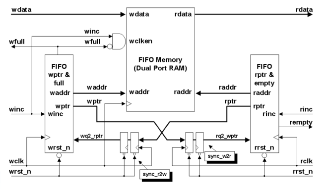
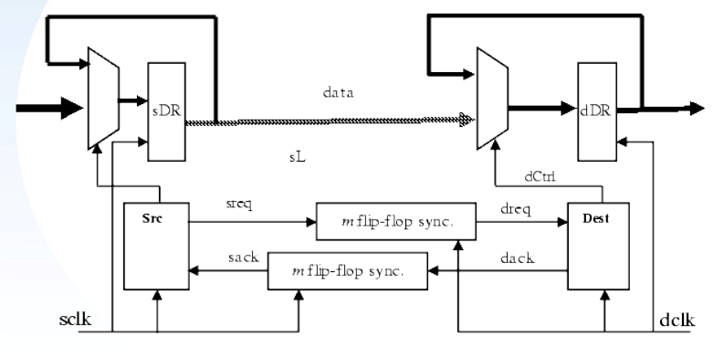

# Clock Domain Crossing Synchronizers

This repository contains various kinds of **CDC synchronizers** implemented in **Verilog**.

## Contents
- Single Bit Synchronizer
  - [NDFF\_syn.v](NDFF_syn.v) (1 Double Flop Synchronizer)
  - [PULSE\_syn.v](PULSE_syn.v)
- multiple-bits-synchronizer
  - [NDFF\_BUS\_syn.v](NDFF_BUS_syn.v) (Multiple Double Flops Synchronizers)
  - [FIFO\_syn.v](FIFO_syn.v)
  - [Handshake\_syn.v](Handshake_syn.v)

## Single Bit Synchronizer

### NDFF_syn.v (1 Double Flop Synchronizer)

Description: Double FFs synchronizer (single bit), the most basic synchronizer.

### PULSE_syn.v

Description: XOR gate in front and in the back of 2 FFs, sends a single pulse to the target clock domain.

---

## Multiple Bits Synchronizer

### NDFF_BUS_syn.v (Multiple Double Flops Synchronizers)

### FIFO_syn.v

Description: Asynchronous FIFO, with **wclk** and **rclk**, synchronous write, synchronous read.

### Handshake_syn.v

Description: Handshake synchronizer.
